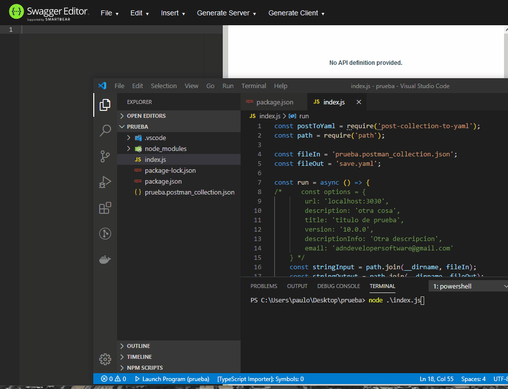

# How to use

### Install dependency

```
npm i post-collection-to-yaml
```
### Import and use

```
const postToYaml = require('post-collection-to-yaml');

const fileIn = 'path/to/post-collection.json';
const fileOut = 'path/to/save.yaml';

const stringInput = path.join(__dirname, fileIn);
const stringOutput = path.join(__dirname, fileOut);
await postToYaml.convert(stringInput, stringOutput);

```

### Make responses easy!
Save you responses on postman, and we will make example for response on swagger

### Params
Recive 2 params: a string of path and file from Postman Collection and a string of output, place to save you swagger file. Can create your report when lifting your service.

### Personalize some params v1 (Optional)
```
const postToYaml = require('post-collection-to-yaml');

const fileIn = 'path/to/post-collection.json';
const fileOut = 'path/to/save.yaml';

  const options = {
    url: 'localhost:3030',
    description: 'server description',
    title: 'titulo de prueba',
    version: '1.2.3',
    descriptionInfo: 'service description',
    email: 'my.awesome.email@mail.com'
  }

const stringInput = path.join(__dirname, fileIn);
const stringOutput = path.join(__dirname, fileOut);
await postToYaml.convert(stringInput, stringOutput, options);

```

### Personalize some params v2 (Optional, with many servers url's)
```
const postToYaml = require('post-collection-to-yaml');

const fileIn = 'path/to/post-collection.json';
const fileOut = 'path/to/save.yaml';

  const options = {
    title: 'titulo de prueba',
    version: '1.2.3',
    descriptionInfo: 'service description',
    email: 'my.awesome.email@mail.com',
     server: [{
      url: 'localhost:3030',
      description: 'server local'
    }, {
      url: 'localhost:3031',
      description: 'server produccion'
    }
    ]
  }

const stringInput = path.join(__dirname, fileIn);
const stringOutput = path.join(__dirname, fileOut);
await postToYaml.convert(stringInput, stringOutput, options);

```

#### Note for path server
if you put array of server thats cancel the url and description for single server

### Example

### Credits
By Paulo Ariel Pareja
