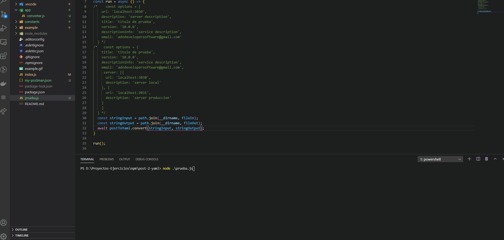

# How to use

### Install dependency

```
npm i post-collection-to-yaml
```
### Import and use

```
const postToYaml = require('post-collection-to-yaml');

const fileIn = 'path/to/post-collection.json';
const fileOut = 'path/to/save.yaml';

const stringInput = path.join(__dirname, fileIn);
const stringOutput = path.join(__dirname, fileOut);
await postToYaml.convert(stringInput, stringOutput);

```
### Params
Recive 2 params: a string of path and file from Postman Collection and a string of output, place to save you swagger file. Can create your report when lifting your service.

### Personalize some params (Optional)
```
const postToYaml = require('post-collection-to-yaml');

const fileIn = 'path/to/post-collection.json';
const fileOut = 'path/to/save.yaml';

const options = {
    url: 'localhost:8080',
    description: 'server description',
    title: 'post-collection-to-yaml',
    version: '1.0.0',
    descriptionInfo: 'service description',
    email: 'adndevelopersoftware@gmail.com'
}

const stringInput = path.join(__dirname, fileIn);
const stringOutput = path.join(__dirname, fileOut);
await postToYaml.convert(stringInput, stringOutput, options);

```

### Example

### Credits
By Paulo Ariel Pareja
